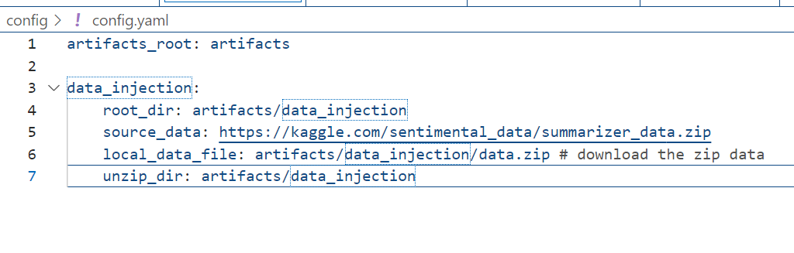
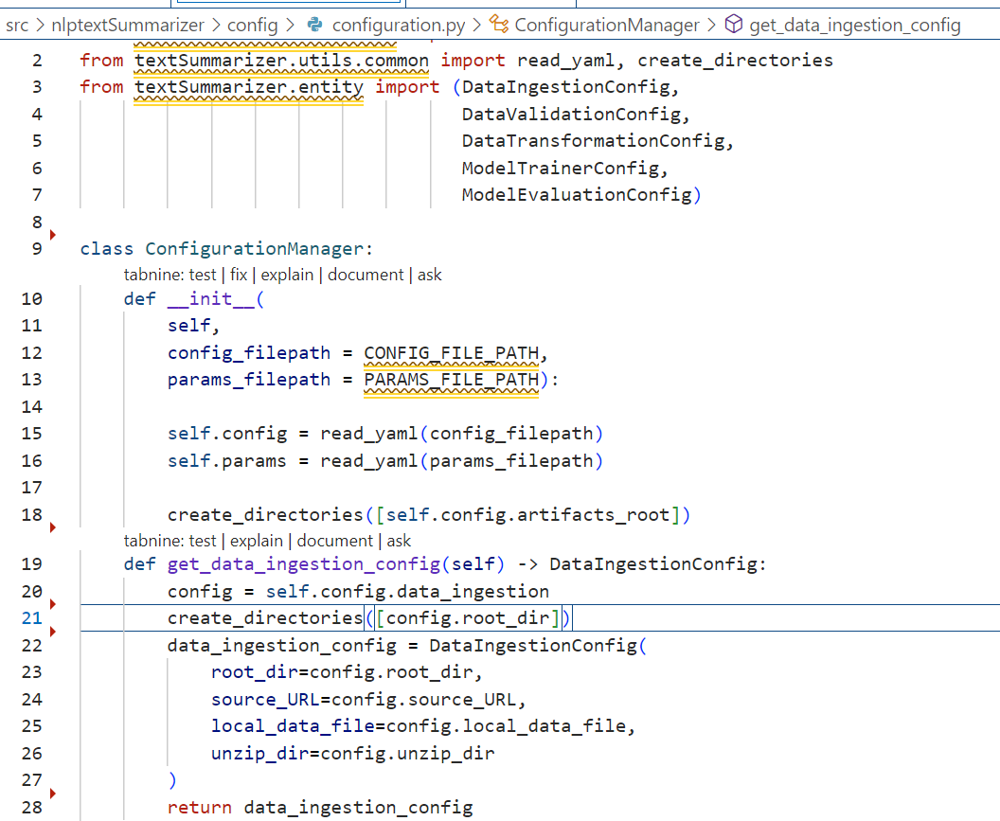
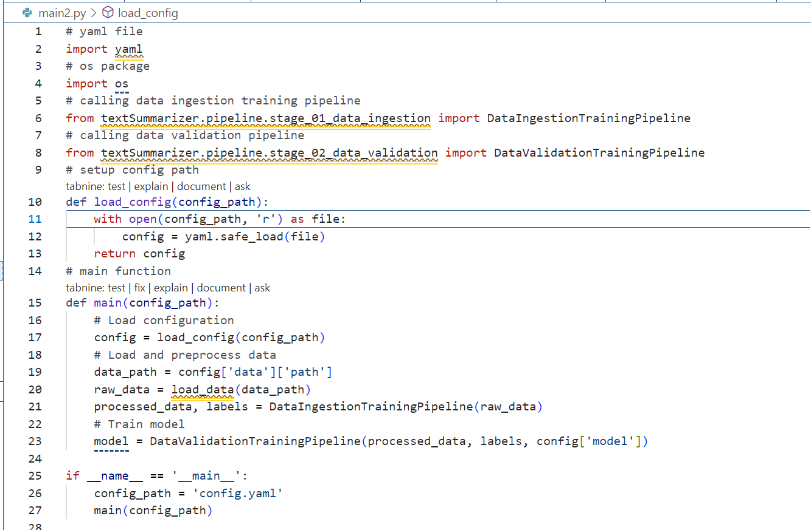
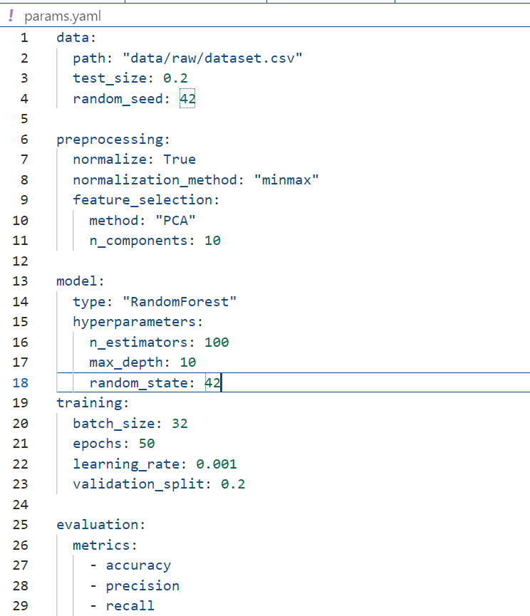
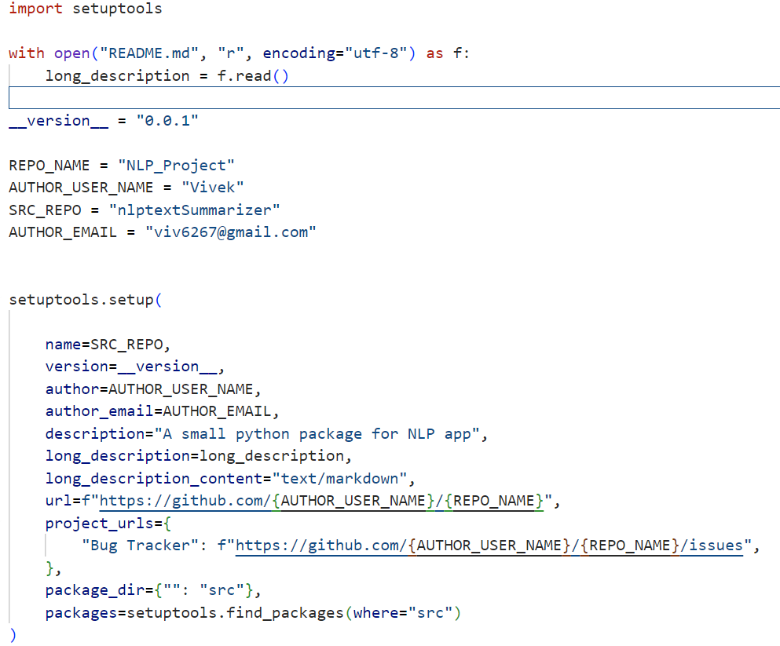

# NLP_Project: This is the root directory of my project.
# README.md file:
Documentation file explaining the project.

## Workflow of the project is:
1. Update config.yaml
2. Update params.yaml
3. Update entity
4. Update the configuration manager in src config
5. Update the components
6. Update the pipeline
7. Update the main.py
8. Update the appy.py

# .github\workflows:- 
This directory typically contains GitHub Actions workflows for CI/CD.

  # .gitkeep:-
    It is just a placeholder. A dummy file, so Git will not forget about the directory, since Git tracks only files. Git will now be able to maintain this directory in the repository.

# Config file: (This directory holds configuration files.)
1. denotes:- config.yml
2. format:- YAML (YAML Ain't Markup Language)

# Use config.yml when:
1. You need a simple, human-readable configuration file.
2. The configuration is static and does not require logic or calculations.
3. You want to maintain portability and compatibility across different environments and programming languages.

# E.g:- 

# Research

1. This directory is likely used for experiments or research-related scripts and notebooks.
2. trails.ipynb: A Jupyter notebook for conducting experiments or trails.

# Source Directory(src)
> This is the main source directory containing the code for the NLP project.

nlptextSummarizer: A sub package within src that includes various components and utilites for text summarization.

# Components within nlptextSummarizer:
1. Components nothing but the data injection, data validation, data transformation and model training.

2. __init__.py: Marks the directory as a Python package.

# Config
1. __init__.py:  Marks the directory as a Python package.

2. configuration.py
# Config purpose
1. Format: Python script

2. Purpose: Used for configuration within Python applications.

3. Data Representation: Python files can contain executable code, allowing dynamic configurations based on logic.

4. Usage: Python files are used in scenarios where the configuration might need to include conditional logic, calculations, or other dynamic behavior that can't be easily represented in a static configuration file.

for e.g dynmaic parameters and conditions
   

# constants:
1. This sub-directory could contain constant values used across the project.

for e.g: 
"""
        from pathlib import Path
        CONFIG_FILE_PATH = Path("config/config.yaml")
        PARAMS_FILE_PATH = Path("params.yaml")

"""
# Entity:
It conatins the configuration of path and data types.In my secnario data injection, data validation, data transformation, modeltrainer and Model evaluation configuration available.

Example:-
    
    """
    class ModelTrainerConfig:
            root_dir: Path
            data_path: Path
            model_ckpt: Path
            num_train_epochs: int
            warmup_steps: int
            per_device_train_batch_size: int
            weight_decay: float
            logging_steps: int
            evaluation_strategy: str
            eval_steps: int
            save_steps: float
            gradient_accumulation_steps: int
    """
# Logging:
In a project folder structure, a logging folder typically contains log files generated by the  application. These log files record various events that occur during the execution of the application, which can be useful for debugging, monitoring, and auditing purposes.

It capture different aspects of the application’s runtime behavior, such as general application logs, error logs, access logs, and performance logs.

# Pipeline:
A pipeline folder in a project typically contains files and scripts related to the data processing and machine learning pipeline. This can include steps for data ingestion, preprocessing, feature engineering, model training, evaluation, and deployment. In the context of a machine learning project, a pipeline folder helps in organizing the various stages of the workflow in a systematic manner.

            nlptextSummarizer/
                ├── pipeline/
                │   ├── __init__.py
                │   ├── data_ingestion.py
                │   ├── data_preprocessing.py
                │   ├── feature_engineering.py
                │   ├── model_training.py
                │   ├── model_evaluation.py
                │   ├── model_deployment.py
                │   ├── pipeline_orchestration.py
                │   ├── config/
                │   │   ├── pipeline_config.yaml
                │   │   └── preprocessing_config.yaml
        
                    for eg:    def fetch_data(source):
                                # Code to fetch data from source
                                    pass

                                    def clean_data(data):
                                        # Code to clean data
                                        pass

                                    def transform_data(data):
                                        # Code to transform data
                                        pass

# Utils:
The utils folder (short for "utilities") in a project is used to store utility scripts, defination and helper functions that are used throughout the project. These utility scripts contain functions and classes that provide common functionalities needed by multiple parts of the application, thus promoting code reusability and organization.

    # defined a function for further use in the code via util.py    
    for e.g: def filter_cohort_table(df->DataFrame, condition->str):
                    if condition =='<=":
                        df=df.filter(F.col('Salary') <= condition)
                    else:
                        df=df.filter(F.col('Salary') == condition)
# .gitignore

A .gitignore file is used in a Git repository to specify files and directories that should be ignored by Git. This means that files and directories listed in the .gitignore file will not be tracked or committed to the repository. This is useful for excluding temporary files, build artifacts, sensitive information, and other files that do not need to be version-controlled.

# Here's an example of a typical .gitignore file for a Python project:
IDE and Editor Specific:
Directories and files created by various IDEs and editors, such as .vscode/, .idea/, *.sublime-*.

# app.py
The app.py file typically serves as the entry point for a Python application, especially for web applications built using frameworks like Flask or Django. In the context of a Flask application, app.py often contains the setup code for the application, including route definitions, configuration settings, and initialization of extensions.

for example:-

        text:str = "What is Text Summarization?"
        app = FastAPI()
        @app.get("/", tags=["authentication"])
        async def index():
            return RedirectResponse(url="/docs")

# Dockerfile
A Dockerfile is a script that contains a series of instructions on how to build a Docker image. Each instruction in a Dockerfile creates a layer in the image, and these layers are cached to speed up the build process. The Dockerfile defines what goes into the container, such as the base image, dependencies, application code, environment variables, and commands to run.

for example:
# 1st step:- FROM python:3.9-slim
##This line specifies the base image to use for the Docker image. In this case, it's a slim version of Python 3.9.

# 2nd:- WORKDIR /app
##This sets the working directory inside the container to /app.

# 3rd: COPY . /app
This copies the current directory contents (where the Dockerfile is located) into the container at /app.

# 4th:- RUN pip install --no-cache-dir -r requirements.txt
This installs the Python packages specified in the requirements.txt file. 
The --no-cache-dir option prevents pip from caching the packages, which reduces the image size.

# 5th:- EXPOSE 80
This makes port 80 available for use by the container. This is the port that the Flask application will listen on.

# 6th: ENV NAME World
This sets an environment variable NAME with the value World. Environment variables can be used to configure the application.

# 7th:- CMD ["python", "app.py"]
This specifies the command to run when the container starts. In this case, it runs the app.py script using Python.

# main.py

In the context of a machine learning project, the main.py file typically serves as the entry point for running the various components of the machine learning pipeline. This can include data loading, preprocessing, model training, evaluation, and saving the trained model. The structure of main.py can vary depending on the complexity of the project and the specific requirements.

For example/demo in this project perspectives:

# Params.yaml
The params.yaml file is typically used in machine learning projects to store configuration parameters and hyperparameters. This file helps in managing and organizing settings related to data processing, model training, evaluation, and other aspects of the machine learning pipeline. Using a params.yaml file ensures that these parameters are easily accessible, modifiable, and version-controlled.

# for example:

# Requirements.txt
The requirements.txt file is used in Python projects to specify and manage the dependencies needed to run the project. It lists the libraries and their versions that the project depends on.

# Requirements.txt Purpose:
1. Reproducibility: Ensures that anyone running the project can install the same dependencies.
2. Ease of Setup: Simplifies the installation process with a single command.

The command to install all the dependencies:
#> pip install -r requirements.txt

# Setup.py

In Python, setup.py is a module used to build and distribute Python packages. It typically contains information about the package, such as its name, version, and dependencies, as well as instructions for building and installing the package. This information is used by the pip tool, which is a package manager for Python that allows users to install and manage Python packages from the command line. By running the setup.py file with the pip tool, you can build and distribute your Python package so that others can use it.

# For Example:-

# template.py 
The template.py file is used to create all the necessary directories and files in a project in a hierarchical manner. It also generates __init__.py files in the source directories to define them as packages, including logging information in each.

 

